# Mitig8 WEB

This is the original **Mitig8** web application I coded years ago.

Mitig8 (Pty) Ltd ran an insurance risk-survey and valuation platform for South African insurers, brokers, and field assessors. This repo is that production web front: an ASP.NET Web Forms shell on AdminLTE 3, talking to SQL Server `mitig8` through Entity Framework 6 and a large stored-procedure layer.

Copyright in the assembly is 2019. The authenticate screen still identifies itself as **Mitig8 Version 2.0.10586 BETA TEST, (c)2022 Mitig8 (Pty) Ltd.** Production lived at `web.mitig8.co.za`; login came in through `secure.mitig8.co.za` with a session token; training sat at `academy.mitig8.co.za`.

This README is a record of what I actually built, and a schema map of the database the EDMX was generated from.

---

## What I built

I did not start from a typical MVC CRUD app. I built a **single-page Web Forms dashboard** that loads feature modules as `.ascx` user controls, hides/shows them from JavaScript and query strings, and does almost all data work through SQL stored procedures.

Specifically:

1. **The product** — a full operational system for insurance **risk assessments**, **building valuations**, **movable-asset valuations**, **survey capture**, **quoting**, **billing**, **wallets**, and **risk-management follow-up**. Assessors go on site, capture surveys/photos/GPS, produce quotes, and insurers/brokers get PDFs and invoices.

2. **The UI shell** — AdminLTE 3 (Bootstrap 4) as the skin. I wrote a custom layout around it:
   - `dashboard.aspx` is the only real application page
   - `Controls/Layout/Menu.ascx` + `Navbar.ascx` are the chrome
   - `Modules/*` are the features, registered onto the dashboard
   - `Controls/Global/*` are notifications, wallet pay, toasts

3. **My own UI kit on top of Web Forms** — `Cloud.cs` is the page helper (cookies, unauthorized redirect, DataTables HTML, JS injection). Around it:
   - `Draw.cs` — bind/populate controls
   - `Modal.cs` — open/close Bootstrap modals from code-behind
   - `Notifier.cs` / `Notify.ascx` — toast + in-app notifications
   - `MessageBox.cs` — SweetAlert dialogs

4. **Auth as a two-hop token exchange** — I did not put a login form on this site.
   - Mobile / secure portal calls `AuthenticateController.getSessionToken` (Web API)
   - SQL `getSessionToken` / `postAuthLogin` writes a row in `Sessions`
   - Browser lands on `authenticate.aspx?Token=...`
   - Code-behind calls `getSessionDetailsToken`, stamps cookies (`UserID`, `Pin`, name, company, user type, picture), then redirects to `/dashboard.aspx`
   - Missing cookie → SweetAlert “Unauthorized” and bounce to `http://secure.mitig8.co.za`

5. **Database-first, procedure-first** — `DataModal.edmx` is an EF6 Database First model against catalog `mitig8` on `MITIG8-SERVER\SQLEXPRESS`. Tables are mapped as entities. **Business logic lives in ~222 `dbo` stored procedures**, imported as function imports on `DataModal`. The web project almost never writes LINQ updates; it calls `DataModal.addAssessment(...)`, `getAssessmentsAllActive(...)`, `updAssessmentQuoteStatus(...)`, etc.

6. **Assessment workflow** I implemented as modules + SPs:
   - Create assessment (`addAssessment`) with type, status, insurer/broker/insured, industry sector, EML/MPL, booking, address
   - Allocate users (`AssessmentUserAllocation`, `updAssignUserAssessment`)
   - Address / booking / policy details
   - On-site survey (`Survey` JSON/XML, `AssessmentSurveys`, `AssessmentSurveyJournal`, `RunSurvey/`)
   - Photos, documents, attachments, GPS tracks (`AssessmentImages`, `AssessmentDocuments`, `AssessmentTrack`, `GeoStamp`)
   - Risk classification + requirements/recommendations
   - Quote against a rate card (`AssessmentQuote`, `AssessmentRateCard`, `QuoteCard` / `QuoteCardSplit` for assessor vs specialist vs profit split, VAT)
   - Building valuation: building → rooms → property details (security, fire, roof, vicinity)
   - Movable-asset valuation: rooms → assets → media (photos/video tagged to items)
   - Specialist review, QA finalize, invoices (assessor + insurer), wallet payouts

7. **PDF / Excel output** — `documents/*.aspx` pages that call `PDF_*` stored procedures and render with PDFsharp / Select.HtmlToPdf / ClosedXML / EPPlus:
   - Executive report, risk report, quote, invoices (assessor & insurer), movable-assets executive summary, SLAs

8. **Wallet / billing** — each user can have a `Wallet` with `WalletAccounts` (bank-linked). `Transactions` move money between accounts. Billing module lists invoices and wallet history. `PayUser.ascx` is the payout modal. CPS statement import (`CPS_Statement`) exists for bank-statement lines.

9. **Integrations I wired in**
   - **Firebase** messenger IDs on `Users` (`updUserFirebaseMessengerID`) for push
   - **Pursuit IMS** policy lookup (`Infrastructure/pursuitims.cs` + `persuitims-test.aspx`) via RestSharp
   - **SurveyJS** (`survey-creator.js`, `Modules/Libraries/Survey.ascx`, `RunSurvey/`) for questionnaire authoring and capture
   - Device / IMEI / Android / Apple IDs on `Devices` for the field app

10. **User types and occupancy permissions** — `UserType` plus `lh_OccupationPermission` (Occupation / Module / Feature / State) so the same dashboard can hide Billing, Reports, Risk Management, Companies, Users depending on who is logged in.

I did **not** write AdminLTE itself. The leftover AdminLTE README, `dist/`, `plugins/`, `docs/`, and demo HTML (`index.html`, `starter.html`, `pages/`) came from that template. Everything under `Modules/`, `Controls/`, `documents/`, `authenticate.aspx`, `dashboard.aspx`, `Cloud.cs`, `Data.cs`, `DataModal.*`, and the SQL model is the Mitig8 work.

---

## Tech stack

| Layer | Choice |
| --- | --- |
| Runtime | ASP.NET Web Forms + Web API on .NET Framework 4.8 |
| Project | `Mitig8.csproj` / `Mitig8.sln`, IIS Express SSL 44305 |
| UI | AdminLTE 3, Bootstrap 4, jQuery 3.3, DataTables, Font Awesome, SweetAlert, Select2, Summernote, FullCalendar |
| ORM | Entity Framework 6.2 Database First (`DataModal.edmx`) |
| Database | SQL Server 2012+ catalog `mitig8` |
| Data access | Stored procedures (add/get/upd/delete/PDF/rep) + a few ADO.NET calls in `Data.cs` |
| JSON | Newtonsoft.Json 12 |
| HTTP client | RestSharp |
| Documents | PDFsharp, Select.HtmlToPdf, ClosedXML, EPPlus |
| Push | Firebase IDs on the user row |

---

## How the app is structured

```
authenticate.aspx          token → cookies → dashboard
dashboard.aspx             host page; ?Module=ASSESSMENT | ASSESSMENT_BUILDING_VALUATION | ASSESSMENT_ASSETS_VALUATION
  Controls/Layout          sidebar menu, navbar
  Controls/Dependencies    AdminLTE header/footer includes
  Controls/Global          notifications, notify modal, wallet
  Modules/Home             landing stats
  Modules/Dashboard        (hidden in menu in this build)
  Modules/Assessments      list + detail + valuations + booking/quote/address/users/risk/requirements modals
  Modules/Valuations       valuation worklist
  Modules/RiskManagement   policy risk follow-up
  Modules/Billing          invoices + wallet
  Modules/Reports          date-range risk / valuation reports
  Modules/Companies        company master
  Modules/Users            user master
  Modules/Profile          profile, pin, password
  Modules/Libraries        survey templates
  Modules/Wallet           pay user
  Modules/Support          support
documents/                 printable PDF pages
RunSurvey/                 survey runner + download
App_Start/                 Web API + routes + bundles
DataModal.edmx             EF model of dbo
```

`Cloud.Page(this)` is called at the top of every page. It disables cache and, if the `UserID` cookie is missing, runs the unauthorized redirect.

---

## Auth and session

```
secure.mitig8.co.za / mobile
        │  GET api/Authenticate?Email&Password&Pin&ApplicationID&IPAddress
        ▼
AuthenticateController.getSessionToken
        │  DataModal.getSessionToken(...)
        ▼
dbo.Sessions  (Token, UserID, Email, Pin, ApplicationID, IPAddress, Active)
        │  browser opens authenticate.aspx?Token=...
        ▼
getSessionDetailsToken + getUserDetailsByID
        │  cookies: UserID, Pin, FirstName, LastName, Email, UserTypeID, CompanyID, Picture, ...
        ▼
dashboard.aspx
```

Blind-token variants exist too (`getSessionTokenBlind`, `updBlindSessionToken`) for kiosk / unattended capture.

---

## Schema map

Source of truth: `DataModal.edmx` SSDL against `mitig8.dbo`. EF did **not** import foreign-key associations (many tables had no PK declared at generation time; EF inferred `ID`). Relationships below are the logical keys the procedures and columns actually use.

### Domain overview

```mermaid
erDiagram
    Organization ||--o{ Company : "OrganizationID"
    CompanyType ||--o{ Company : "CompanyTypeID"
    Company ||--o{ User : "CompanyID"
    UserType ||--o{ User : "UserTypeID"
    IdentityType ||--o{ User : "IdentityTypeID"
    User ||--o{ Session : "UserID"
    User ||--o{ Device : "UserID"
    User ||--o{ Notification : "UserID"
    User ||--o{ Wallet : "UserID"
    User ||--o{ Assessment : "UserID"
    Application ||--o{ Session : "ApplicationID"
    Application ||--o{ GeoStamp : "ApplicationID"
    Device ||--o{ GeoStamp : "DeviceID"

    Wallet ||--o{ WalletAccount : "WalletID"
    WalletAccountType ||--o{ WalletAccount : "AccountTypeID"
    Bank ||--o{ WalletAccount : "BankID"
    WalletAccount ||--o{ Transaction : "FromAccountID / ToAccountID"
    TransactionType ||--o{ Transaction : "TransactionTypeID"
    TransactionStatu ||--o{ Transaction : "TransactionStatusID"
    Invoice ||--o{ Transaction : "InvoiceID"

    AssessmentType ||--o{ Assessment : "AssessmentTypeID"
    AssessmentStatu ||--o{ Assessment : "AssessmentStatusID"
    District ||--o{ Assessment : "DistrictID"
    IndustrySector ||--o{ IndustrySubSector : "IndustrySectorID"
    IndustrySubSector ||--o{ IndustrySectorClass : "IndustrySubSectorID"
    IndustrySector ||--o{ Assessment : "IndustrySectorID"

    Assessment ||--o{ AssessmentAddress : "AssessmentID"
    Assessment ||--o{ AssessmentClientBooking : "AssessmentID"
    Assessment ||--o{ AssessmentPolicyDetail : "AssessmentID"
    Assessment ||--o{ AssessmentQuote : "AssessmentID"
    Assessment ||--o{ AssessmentSurvey : "AssessmentID"
    Assessment ||--o{ AssessmentTrack : "AssessmentID"
    Assessment ||--o{ AssessmentUserAllocation : "AssessmentID"
    Assessment ||--o{ AssessmentDocument : "AssessmentID"
    Assessment ||--o{ AssessmentImage : "AssessmentID"
    Assessment ||--o{ AssessmentAttachment : "AssessmentID"
    Assessment ||--o{ AssessmentRequirement : "AssessmentID"
    Assessment ||--o{ AssessmentReview : "AssessmentID"
    Assessment ||--o{ AssessmentBuilding : "AssessmentID"
    Assessment ||--o{ AssessmentPropertyDetail : "AssessmentID"
    Assessment ||--o{ AssessmentExpense : "AssessmentID"
    Assessment ||--o{ AssessmentRiskClassificationSummary : "AssessmentID"
    Assessment ||--o{ Invoice : "via billing"

    AssessmentCategory ||--o{ AssessmentSubCategory : "AssessmentCategoryID"
    AssessmentSubCategory ||--o{ AssessmentType : "AssessmentSubCategoryID"
    Survey ||--o{ AssessmentSurvey : "SurveyID"
    Survey ||--o{ AssessmentSurveyAssociation : "SurveyID"
    AssessmentType ||--o{ AssessmentSurveyAssociation : "AssessmentTypeID"

    AssessmentBuilding ||--o{ AssessmentRoom : "BuildingID"
    AssessmentRoomType ||--o{ AssessmentRoom : "RoomTypeID"
    AssessmentRoom ||--o{ AssessmentAsset : "RoomID"
    AssessmentRoom ||--o{ AssetMedia : "RoomID"
    AssetCategory ||--o{ AssetSubCategory : "AssetCategoryID"
    AssessmentAsset ||--o{ AssetMediaItem : "AssetID"

    QuoteCard ||--o{ QuoteCardSplit : "QuoteCardID"
    QuoteCard ||--o{ AssessmentQuote : "QuoteCardID"
    AssessmentRateCard ||--o{ AssessmentQuote : "AssessmentRateCardID"
    AssessmentQuote ||--o{ AssessmentQuoteDecon : "QuoteID"
```



### Core identity and tenancy

```
Organization
    └── Company  (CompanyTypeID → CompanyType)
            ├── User  (UserTypeID → UserType, IdentityTypeID → IdentityType)
            │     ├── Session / Device / GeoStamp / Notification
            │     ├── Wallet → WalletAccount → Transaction
            │     └── AssessmentUserAllocation (role on a job)
            └── AssessmentRateCard (per company + assessment type + valuation band)
CustodiansPerOrganization  (OrganizationID, UserID)
lh_OccupationPermission    (OccupationID, ModuleID, FeatureID, StateID)
```

### Assessment (the centre of the model)

`Assessment` is the job file. It holds type/status, creator, references (internal, customer, policy, claim), insurer/broker/insured contact block, industry classification, EML/MPL + comments, booking, street address denormalized onto the row, survey JSON, quote amount, recipient OTP/signature/rating, and `TotalValuationAmmount`.

Child tables hang off `AssessmentID`:

| Child | Role |
| --- | --- |
| `AssessmentAddress` | structured street + `DistrictID` |
| `AssessmentClientBooking` | booking date, OTP confirm |
| `AssessmentPolicyDetails` / `AssessmentPolicyElements` | cover elements and sums insured |
| `AssessmentReference` | extra reference numbers |
| `AssessmentUserAllocation` | assessor / specialist assignment + confirm |
| `AssessmentTrack` | status timeline with GPS, photo, signature |
| `AssessmentSurveys` | survey instance (questions/answers as XML) |
| `AssessmentSurveyJournal` | per-question name/value log |
| `AssessmentImages` / `AssessmentDocuments` / `AssessmentAttachments` | media |
| `AssessmentReview` | specialist comments per survey category |
| `AssessmentRequirement` + `AssessmentRequirementDocuments` | risk requirements / recommendations |
| `AssessmentRiskClassificationSummary` | factor × policy element × rating |
| `AssessmentQuote` + `AssessmentQuoteDecon` | commercial quote and fee split |
| `AssessmentExpense` | disbursements |
| `AssessmentBuilding` → `AssessmentRoom` → `AssessmentAsset` | valuation tree |
| `AssessmentPropertyDetails` | residence type, roof, security, fire |

Lookups feeding assessment:

- Type tree: `AssessmentCategory` → `AssessmentSubCategory` → `AssessmentType` (type also stores default `SurveyJSON`)
- Status: `AssessmentStatus` (optionally scoped by `UserTypeID` + `Code`)
- Survey library: `Survey` (XML JSON) → `SurveyCategories`; linked to types via `AssessmentSurveyAssociations`
- Industry: `IndustrySector` → `IndustrySubSector` → `IndustrySectorClass`
- Geography: `District` (Province / Town / Suburb / PostalCode / CountryCode)
- Property lookups: `TypeOfResidence`, `RoofConstruction`, `Vicinity`, `ExtendOfLand`, `Borders`, `AssessmentRoomType`
- Risk lookups: `RiskType`, `AssessmentRiskFactor`, `AssessmentRiskClassificationFactor`
- Quote: `QuoteCard` → `QuoteCardSplit` (share % by `UserTypeID`); `AssessmentRateCard` (fee band by valuation range and date)

### Valuation tree

```
Assessment
  └── AssessmentBuilding
        └── AssessmentRoom  (RoomTypeID → AssessmentRoomType)
              ├── AssessmentAsset  (CategoryID / SubCategoryID / UOM_ID)
              └── AssetMedia
                    └── AssetMediaItem  (tagged to AssessmentAsset, optional timestamp)
AssessmentPropertyDetails  (security + fire flags on the risk address)
AssetCategory → AssetSubCategory
UOM
```

### Money

```
User → Wallet → WalletAccount (BankID, AccountTypeID, Balance, Pending)
WalletAccount ← Transactions → WalletAccount   (FromAccountID / ToAccountID)
Invoice  (BillingEntityID + BillingEntityTypeID, From/To accounts, Amount, Balance, Reference)
CPS_Statement  (imported bank statement lines)
```

Quote money is separate from wallet money: `AssessmentQuote` stores insurer fee, VAT, assessor/specialist/profit totals; `AssessmentQuoteDecon` is the per-user-type due amount.

### Table inventory (`mitig8.dbo`)

81 mapped tables. Identity column is `ID` unless noted.

**Platform**

| Table | Purpose | Keys / notable columns |
| --- | --- | --- |
| `Applications` | calling app (web / mobile) | Description, cDate |
| `Sessions` | login tokens | UserID, Token, Email, Password, Pin, ApplicationID, IPAddress, Active, sDate |
| `Users` | people | Pin, Password, CompanyID, UserTypeID, IdentityTypeID, Email, Cellphone, IdentityNumber, FirebaseID, FirebaseMessengerID, signature, Picture, Active |
| `UserType` | role lookup | Description |
| `IdentityType` | ID document type | Description |
| `Devices` | field devices | UserID, IMEI, AndroidDeviceID, AppleDeviceID, Code |
| `GeoStamp` | GPS breadcrumb | UserID, DeviceID, ApplicationID, Lon/Lat, Speed, Altitude |
| `Notifications` | in-app messages | UserID, NotificationTypeID, NotificationStatusID, Title, Message, isHTML |
| `NotificationType` / `NotificationStatus` | lookups | Description |
| `lh_OccupationPermission` | RBAC matrix | OccupationID, ModuleID, FeatureID, StateID |
| `sysdiagrams` | SSMS diagrams | (SQL tooling, not app) |

**Organisations**

| Table | Purpose | Keys / notable columns |
| --- | --- | --- |
| `Organization` | parent org | Name, DistrictID, CompanyID, RegNo, VatNo, contacts |
| `Companies` | insurer / broker / assessor firm | CompanyTypeID, OrganizationID, Code, VATRegNo, AssessorMaxPolicyValue, bank fields, geo |
| `CompanyType` | lookup | Description |
| `CustodiansPerOrganization` | org admins | OrganizationID, UserID |
| `District` | SA address lookup | Province, Town, Suburb, PostalCode, CountryCode |
| `Bank` | bank lookup | Description, BranchCode, Logo |

**Assessment core**

| Table | Purpose | Keys / notable columns |
| --- | --- | --- |
| `Assessment` | job file | AssessmentTypeID, AssessmentStatusID, UserID, DistrictID, Industry*ID, references, insurer/broker/insured, SurveyJSON, Quote, EML, MPL, Booking*, address fields, TotalValuationAmmount, DateCompleted |
| `AssessmentType` | product type | AssessmentSubCategoryID, SurveyJSON |
| `AssessmentCategory` / `AssessmentSubCategory` | type tree | SubCategory.AssessmentCategoryID |
| `AssessmentStatus` | workflow state | UserTypeID, Code |
| `AssessmentAddress` | structured address | AssessmentID, DistrictID, AddressStatusID |
| `AssessmentClientBookings` | site booking | AssessmentID, BookingDate, OTP* |
| `AssessmentPolicyDetails` | cover lines | AssessmentID, ElementID, Covered, Sum |
| `AssessmentPolicyElements` | cover element catalog | AssessmentID, Description |
| `AssessmentReference` | extra refs | AssessmentID, Reference |
| `AssessmentUserAllocation` | job assignment | AssessmentID, UserID, AssessmentUserRoleID, Confimed* |
| `AssessmentTrack` | timeline / proof | AssessmentID, AssessmentStatusID, AssessmentTrackTypeID, Lon/Lat, Picture, Signature |
| `AssessmentTrackType` | track kind | Description |

**Survey / risk / media**

| Table | Purpose | Keys / notable columns |
| --- | --- | --- |
| `Survey` | template | Title, JSON (xml), Active, UserID |
| `SurveyCategories` | sections of a survey | SurveyID |
| `AssessmentSurveyAssociations` | type ↔ survey | AssessmentTypeID, SurveyID, Active |
| `AssessmentSurveys` | filled survey | AssessmentID, SurveyID, AssessorUserID, AssessmentSurveyStatusIS, SurveyQuestionsJSON, SurveyAnswersJSON |
| `AssessmentSurveyStatus` | lookup | Description |
| `AssessmentSurveyJournal` | Q/A log | AssessmentID, SurveyID, Name, Value |
| `AssessmentImages` | photos | AssessmentID, PictureURL, SurveyCategoryID, Location, Comment |
| `AssessmentDocuments` | files | AssessmentID, DocumentURL, FileName, Type |
| `AssessmentAttachments` | extra files | AssessmentID, SurveyCategoryID, DocumentURL |
| `AssessmentReview` | specialist review | AssessmentID, SurveyCategoryID, Message, Response |
| `AssessmentRequirement` | recommendation | AssessmentID, RiskTypeID, RiskRatingID, PriorityID, Deadline*, StatusID |
| `AssessmentRequirementDocuments` | proof against a requirement | AssessmentRequirementID |
| `AssessmentRiskFactor` / `AssessmentRiskClassificationFactor` | lookups | Description |
| `AssessmentRiskClassificationSummary` | scored matrix | AssessmentID, AssessmentRiskFactorID, AssessmentPolicyElementsID, AssessmentRiskRatingID, Reason |
| `RiskType` | requirement type | Description |
| `IndustrySector` / `IndustrySubSector` / `IndustrySectorClass` | occupancy | chained IDs |
| `AssessmentExpense` / `AssessmentExpenseType` | disbursements | AssessmentID, Total, DocumentURL |

**Valuation**

| Table | Purpose | Keys / notable columns |
| --- | --- | --- |
| `AssessmentBuilding` | structure on site | AssessmentID, Title |
| `AssessmentRoom` | room in building | BuildingID, RoomTypeID |
| `AssessmentRoomType` | lookup | Description |
| `AssessmentAsset` | movable item | RoomID, CategoryID, SubCategoryID, UOM_ID, Qty, Price, SKU, Specified |
| `AssetCategory` / `AssetSubCategory` | asset taxonomy | RoomTypeID on category |
| `UOM` | unit of measure | Description |
| `AssetMedia` | room photo/video | RoomID, MediaURL, isCover, LevelID |
| `AssetMediaItems` | media tagged to an asset | AssetMedia, AssetID, DurationAt |
| `AssessmentPropertyDetails` | property / security / fire | AssessmentID, TypeOfResidenceID, RoofConstructionID, VicinityID, ExtendoflandID, BordersID, security & fire flags |
| `TypeOfResidence` / `RoofConstruction` / `Vicinity` / `ExtendOfLand` / `Borders` | property lookups | Description |

**Commercial**

| Table | Purpose | Keys / notable columns |
| --- | --- | --- |
| `QuoteCard` | fee-split template | Title, Active |
| `QuoteCardSplit` | % by user type | QuoteCardID, UserTypeID, SharePercent |
| `AssessmentRateCard` | fee by valuation band | AssessmentTypeID, CompanyID, ValuationFrom/To, TotalFee, DateFrom/To, InsurerRateCardID |
| `AssessmentQuote` | quote on a job | AssessmentID, QuoteCardID, AssessmentRateCardID, Quote, VAT_*, AssessorTotal, SpecialistTotal, ProfitTotal, QuoteStatusID, CompanyID |
| `AssessmentQuoteDecon` | split due | QuoteID, UserTypeID, Due, Override |
| `AssessmentQuoteStatus` | lookup | Description |
| `Invoice` | billing document | BillingEntityID, BillingEntityTypeID, FromAccountID, ToAccountID, Amount, Balance, Reference |
| `Wallet` | KYC wallet | UserID, WalletStatusID, ProofOfIdentification, ProofOfAddress |
| `WalletAccounts` | ledger account | WalletID, UserID, BankID, AccountTypeID, AccountNumber, Balance, Pending |
| `WalletAccountType` | lookup | Description |
| `Transactions` | ledger movement | FromAccountID, ToAccountID, TransactionTypeID, TransactionStatusID, Amount, Balance, InvoiceID, CreditNoteID |
| `TransactionType` / `TransactionStatus` | lookups | Description |
| `CPS_Statement` | imported statement line | CISNumber, Account, Amount, DebitCredit, TransactionDate, UserRef |

---

## Stored procedures

The EDMX imports **222** `dbo` procedures (excluding SSMS diagram helpers). Naming is the API:

| Prefix | Meaning | Examples |
| --- | --- | --- |
| `add*` | insert | `addAssessment`, `addAssessmentQuote`, `addAsset`, `addWalletAccount` |
| `get*` | read / list | `getAssessmentsAllActive`, `getAssessmentGeneralInformation`, `getBillingTransactions` |
| `upd*` | update | `updAssessmentGeneralInformation`, `updAssessmentQuoteStatus`, `updWalletAccountTransfer` |
| `delete*` / `del*` | delete | `deleteAssessmentBuilding`, `delInvoice_AdminTool` |
| `PDF_*` | HTML/PDF payloads | `PDF_ExecutiveReport`, `PDF_RiskReport`, `PDF_getInvoice_Assessor` |
| `rep*` | reports | `repAssessmentRisk` (also called from `Data.cs`) |
| `post*` | auth / geo | `postAuthLogin`, `postAuthRegister`, `postAddDistrict` |
| `Mobile_*` | field app | `Mobile_getAssessments` |
| other | workflow | `cancelAssessment`, `DuplicateAssessment`, `appointMoovableAssetsValuator`, `confirmMoveableAssetsQuote`, `payInvoices`, `Notify`, `sendMail` |

Auth-related: `postAuthLogin`, `postAuthRegister`, `addRegisterUser`, `getSessionToken`, `getSessionDetailsToken`, `getSessionTokenBlind`, `updBlindSessionToken`, `getUserDetailsByID`, `updUserProfilePassword`, `updUserProfilePin`, `updUserFirebaseMessengerID`.

---

## Documents / PDFs

| Page | What it prints |
| --- | --- |
| `documents/ExecutiveReport.aspx` | assessment executive report |
| `documents/RiskReport.aspx` | risk report |
| `documents/Quote.aspx` | quote |
| `documents/Invoice.aspx` / `Invoice-Assessor.aspx` / `Invoice-Insurer.aspx` | invoices |
| `documents/AssessmentDetails.aspx` | assessment dump |
| `documents/AssessmentValuationMoveableAssets-ExecutiveSummary.aspx` | movable-asset valuation summary |
| `documents/UserReport.aspx` | user report |
| `documents/assessor-sla.aspx` / `insurer-sla.aspx` | SLA docs |

---

## What this is not

- Not the current Mitig8 rewrite. This is the old Web Forms production app.
- Not an AdminLTE sample. The AdminLTE files are the UI framework I used; the product is the modules, EDMX, and SQL.
- Not Code First. Regenerating `DataModal.edmx` from SQL overwrites the generated `.cs` entities.

---

## Run (historical)

Visual Studio, IIS Express, .NET Framework 4.8. Connection is EF name `DataModal` in `Web.config` → SQL Server instance `MITIG8-SERVER\SQLEXPRESS`, catalog `mitig8`.

Entry after a valid token: `authenticate.aspx?Token=...` then `dashboard.aspx`.
